# Dependency Graph

**Generated:** 2026-08-17 by `tools/engineering-registry.js`
**Status:** DESCRIPTIVE — derived from code, not authored.
**Do not edit by hand.** Regenerate instead: `node tools/engineering-registry.js`

**Objects indexed:** 83

---

```mermaid
graph LR
  platformFoundationRoutes --> platformCoreService
  platformFoundationRoutes --> userManagementService
  platformFoundationRoutes --> roleManagementService
  enterpriseControlRoutes --> enterpriseControlService
  communityRoutes --> communityService
  logisticsEnhancementRoutes --> logisticsEnhancementService
  governanceModule --> governanceService
  marketplaceEnhancements --> gstService
  marketplaceEnhancements --> productReviewService
  marketplaceEnhancements --> bulkOrderService
  researchAndDevelopmentRoutes --> researchAndDevelopmentService
  informationSharingRoutes --> informationSharingService
  knowledgeRoutes --> knowledgeService
  sheepRoutes --> sheepService
  goatRoutes --> goatService
  logisticsEnhancements --> logisticsEnhancementService
  pigRoutes --> pigService
  farmerPortalEnhancements --> landRecordsService
  farmerPortalEnhancements --> cropPlanningService
  farmerPortalEnhancements --> farmerService
  poultryRoutes --> poultryService
  sapModuleArchitectureRoutes --> sapModuleArchitectureService
  insuranceEnhancements --> insurancePremiumService
  insuranceEnhancements --> insurancePolicyIssuanceService
  insuranceEnhancements --> insuranceFraudDetectionService
  gstRoutes --> gstService
  costControlRoutes --> costControlService
  aiBrainRoutes --> aiBrainService
  animalHealthRoutes --> animalHealthService
  experienceRoutes --> experienceLayerService
  projectSystemsRoutes --> projectSystemsService
  aiOperationIntelligenceRoutes --> aiOperationIntelligenceService
  enterpriseAIRoutes --> financialService
  enterpriseAIRoutes --> governmentSchemeService
  enterpriseAIRoutes --> aiOrchestrationService
  recoveredFinanceRoutes --> recoveredFinanceService
  dairyRoutes --> dairyService
  aiSelfHealingRoutes --> aiSelfHealingService
  platformCoreRoutes --> platformCoreService
  riskPricingRoutes --> riskPricingService
  riskPricingRoutes --> dynamicPricingService
  vendorRoutes --> decisionSupportService
  weatherRoutes --> weatherService
  aiAgentRoutes --> aiAgentService
  organizationManagementRoutes --> organizationManagementService
  platformConfigurationRoutes --> platformConfigurationService
  unifiedLedgerRoutes --> unifiedLedgerService
  advancedFeatures --> advancedFeaturesService
  agriculturalIntelligenceRoutes --> agriculturalIntelligenceService
  assetAccountingRoutes --> assetAccountingService
  decisionSupportRoutes --> decisionSupportService
  rfqRoutes --> rfqService
  tenantManagementRoutes --> tenantManagementService
  auditRoutes --> auditService
  coldStorageRoutes --> coldStorageService
  complianceRoutes --> complianceService
  hrRoutes --> hrService
  systemAdministrationRoutes --> systemAdministrationService
  aiGatewayRoutes --> aiGatewayService
  cooperativeShareRoutes --> cooperativeShareService
  farmerRoutes --> farmerService
  fertilizerRoutes --> fertilizerInventoryService
  foodRoutes --> FoodIntelligenceEngine
  energyRoutes --> EnergyCostCalculator
  equipmentExchangeRoutes --> equipmentExchangeService
  freightPoolingRoutes --> freightPoolingService
  geofencingRoutes --> geofencingService
  marketDataRoutes --> marketDataService
  seedVaultRoutes --> seedVaultService
  civilDisruptionRoutes --> civilDisruptionService
  dprGenerationRoutes --> dprGenerationService
  foluRoutes --> organicTraceabilityService
  regionalVarietyRoutes --> regionalVarietyService
  climateAdvisoryRoutes --> weatherService
  companyRoutes --> companyService
  returnLoadBoardRoutes --> returnLoadBoardService
  demandRoutes --> demandService
  costRoutes --> costService
  foluBenchmarkRoutes --> foluBenchmarkService
  glutWarningRoutes --> glutWarningService
  revenueRoutes --> revenueService
  sellerRankingRoutes --> sellerRankingService
  wikipediaRoutes --> wikipediaService
```

Service-to-service edges: **83**. Low coupling is intentional —
services communicate through the signal bus rather than direct requires.
